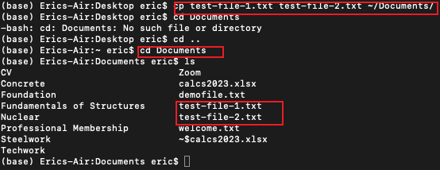
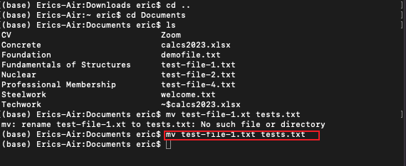
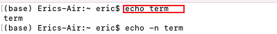

# Linux Practice Project

## File Manipulation

### 1. Sudo command

On macOS, the equivalent of the `sudo apt upgrade` command used on Debian-based Linux distributions (like Ubuntu) is achieved through the macOS package manager called Homebrew. Therefore, the equivalent command to achieve the same function are shown below 

###### sudo apt update equivalent on mac

###### sudo apt upgrade equivalent on mac

### 2. pwd

The `pwd` command is used to determine ones current working directory. This command has two option ` -L` which prints envoromnet variable content, including symbolic liknks, and ` -P` which prints the actual path of the current directory.

###### pwd

### 3. cd command

The cd command is used to navigate through Linu files and directories. Depending on the current working directory, it requires either the full path or directory name. 

###### cd

### 4 ls command

This command list all the files and directories within a system. when run without a file or parameter will show the current working directory;s content.

In the example below the `ls` command was used without a parameter when the current working folder was in `Home` and the second shows when run with a parameter `Documents`

###### ls

In addition, `ls -R` lists all the files in the subdirectories, `ls -a` lists all hidden files in addtion to the visible ones while `ls -lh` shows the size of the files in easily readable formats, such as MB, GB, and TB.

### 5 cat command
This is known as concatenate or cat -  it lists, combines and writes file contect to the standard output. The examples below shows this function and an additional function `tac` (`gtac` on mac) which reverses, including a demonstration of concatenation of two files into a third file. 

###### cat

### 6 cp command

This used to copy a file from one location to another, use the `cp` command followed by the source file and the destination directory or file path.

###### cp

### 7 mv command

Used to move file from one location to another or rename the file

### 8 mkdir command

Used to create a directory or files inside directory

### 9 rmdir command

Used to remove empty directory

### 10 rm command

Used to remove file or multifiles

### 11 touch command

used for creating an empty file 

### 12 touch command

for finding file in a datbase. the use of `*` and adding `-i` will find file with both names

### 13 find command

used to find files in the current directory and it subdirectories

### 14 grep command

This command finds a value within a file 

### 15 df command

For finding the directory's system disk spaceusage in human readable format

### 16 du command

used to howmych space a file or directory takes up.

### 17 head command

Used to display the first 10line of a text. This can also be modified to see specific number of lines

### 18 tail command

it is used to view the last ten lines of a file. it is used to see if new data gas been added or read error massages

### 19 diff command

it used to find the difference in the content of two files.

### 20 tar command

used for achiving files 

### 21 chmod command

This is used to change modify a file or directories red, write and execute permissions

### 22 chown command

This command allows you to change the ownership of a file, directory, or symbolic link to a specified username

### 23 jobs command

a job is process  that the shell starts. the jobs commmand will display all the running process along with their statuses. Remember that this command is only availble in `csh, baxh, tcsh, and ksh` shells

### 24 kill command

The Kill command is used to terminate an unresponsive programm manually. it will signal misbehaving applications and instruct them to close thier processes.

### 25 ping command

it is used to determine whether a network or server is reachable. Inaddition, it is used to troubleshoot various connectivity issues.

### 26 wget command

This command lets you download files from the internet using the wget command. It works in the background without hindering other running processes.

### 27 uname command

This command prints detailed information about your system and hardware. 

### 28 top command

This commands shows all the runnig processes and dynamic real-time view of the current system. It sums up the utilization from the CPU to memory usage.

### 29 history command

This system will list up to 500 previously executed commands, allowing you to resuse them without re-entering. 

### 30 man command

The man command provides a user manual of any commands or utilities you can run in Terminal, icluding the name, description, and options.

### 31 echo command

This is a built-in utility that dospalys a lone of text or strings using the standard output.

### 32 Zip, Unzip command

The `ZIP` command is used to compress files to Zip and archive files into directories and reducing disk usage. The `unzip` command is used to extract files from a zipped folder

### 33 hostname command
This is used to determine the hostname of the system and with other optional flags could be used to know the system's IP address - it works on windows but the optional commands are different on Mac

### 34 useradd, userdel  command

The useradd command is used to add a new user and set their password . The userdel is used to delete a user

### 35 apt-get   command

The apt-get command is specific to Debian-based Linux distributions, such as Ubuntu. On macOS, which is a Unix-based operating system, you would typically use a different package manager. On macOS, the default package manager is brew, also known as Homebrew. 

### 36 nano, vi jed commands

These commands are used to open text editors. 
for `vi` once you are in the vi environment, press `i` to insert texts and edit. `ctrl + O` to save, esc, then enter `:wq` to exit

### 37 alais, unalias commands

Alias is used to make an alias or susbstitiute for a  file name and the unalias is to take an already initiated alias function away

### 38 su command

This is a switch user command wihich runs through root privileges

### 39 htop command
htop ( or top in mac) is another interactive system monitoring tool, similar to top, but with a more user-friendly and visually appealing interface. It provides a dynamic, colorized representation of system resource usage and allows users to interactively manage processes.

### 40 ps command

The ps command shows the snapshot of the processes running on your system

